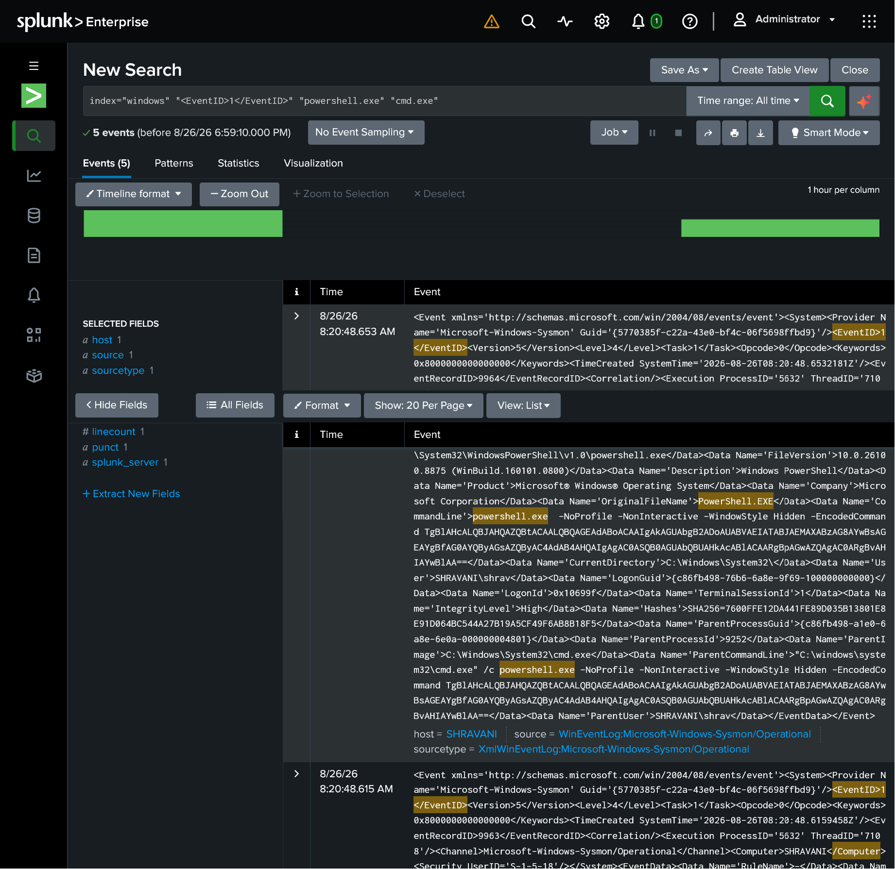
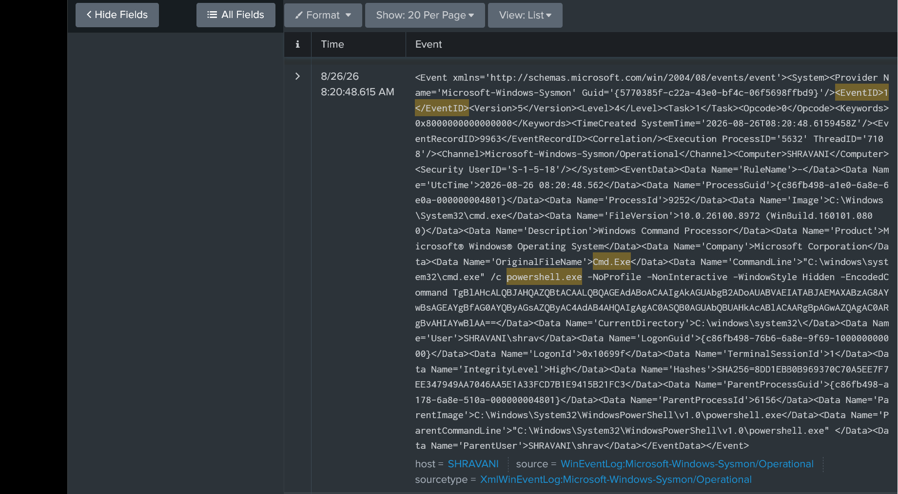

# Multi-Stage SOC Investigation Project

This repository documents a hands-on Security Operations Center (SOC) investigation lab. The project simulates suspicious activity on a Windows endpoint, collects the activity as security logs, sends those logs to a centralized SIEM, and investigates them to understand what happened.

The goal is to practice the same basic workflow used by SOC analysts: **collect → search → investigate → correlate → conclude.**

---

## 🛠️ Lab Architecture

The lab uses two virtual machines:

* **Windows 11 VM** — The endpoint where the activity is simulated and monitored.
* **Ubuntu Server 26.04 VM** — The server running Splunk Enterprise.

### Tools Used

| Tool                           | Purpose                                                      |
| ------------------------------ | ------------------------------------------------------------ |
| **Sysmon**                     | Monitors Windows activity and creates detailed security logs |
| **Splunk Universal Forwarder** | Sends Windows/Sysmon logs from Windows to Splunk             |
| **Splunk Enterprise**          | Receives, stores, and searches the collected logs            |
| **Splunk Web**                 | Web interface used to investigate the logs                   |

### How the Logs Move

```text
Windows 11
    │
    │ Sysmon records activity
    ▼
Splunk Universal Forwarder
    │
    │ Sends logs
    ▼
Ubuntu Server
    │
    │ Splunk Enterprise
    ▼
Splunk Web Interface
    │
    ▼
SOC Analyst
```

Splunk Enterprise is installed on the Ubuntu VM. The Splunk Web interface is accessed through a browser from the Windows machine. The browser is simply connecting to Splunk running on Ubuntu.

---

# 🔬 Investigation 01: Suspicious PowerShell Execution

**Date:** August 26, 2026
**Analyst:** shrav
**Status:** Initial Investigation Completed
**Environment:** Controlled Lab Simulation

---

## 📋 Scenario

A user reported that a black terminal window appeared briefly on their Windows 11 workstation (`SHRAVANI`) and then disappeared.

The objective was to investigate what happened using the security logs collected from the Windows endpoint.

---

## 🕵️ Step 1 — Finding the PowerShell Activity

Instead of searching directly for a known suspicious keyword such as `EncodedCommand`, the investigation started by looking for **process creation events** involving PowerShell and Command Prompt.

The following SPL query was used in Splunk:

```spl
index="windows" "<EventID>1</EventID>" "powershell.exe" "cmd.exe"
```

### What is SPL?

**SPL (Search Processing Language)** is the language used to search and analyze logs in Splunk.

In simple terms, this query tells Splunk:

> "Search the Windows logs for process creation events involving `powershell.exe` and `cmd.exe`."

**Sysmon Event ID 1** represents **Process Creation**, meaning a new program/process was started.

---

## 📊 Step 2 — Evidence Found

The search identified the following event:

| Field                   | Value                                                                                                                     |
| ----------------------- | ------------------------------------------------------------------------------------------------------------------------- |
| **Timestamp**           | `2026-08-26 08:20:48.653 AM`                                                                                              |
| **Host**                | `SHRAVANI`                                                                                                                |
| **User**                | `SHRAVANI\shrav`                                                                                                          |
| **Process ID**          | `7956`                                                                                                                    |
| **Image**               | `C:\Windows\System32\WindowsPowerShell\v1.0\powershell.exe`                                                               |
| **Parent Process ID**   | `9252`                                                                                                                    |
| **Parent Image**        | `C:\Windows\System32\cmd.exe`                                                                                             |
| **Command Line**        | `powershell.exe -NoProfile -NonInteractive -WindowStyle Hidden -EncodedCommand <Base64>`                                  |
| **Parent Command Line** | `"C:\windows\system32\cmd.exe" /c powershell.exe -NoProfile -NonInteractive -WindowStyle Hidden -EncodedCommand <Base64>` |


### 📸 Central SIEM Investigation Exhibit (All Screenshot Artifacts)

#### Exhibit A: Native Shell Hunt and Query Validation
*Demonstrates execution of the target SPL filtering loop across the centralized log storage folder.*


#### Exhibit B: Expanded Event ID 1 & Telemetry Mapping
*Verifies the live ingestion connection by extracting the core process creation tokens directly from the SIEM database.*


#### Exhibit C: Obfuscated Parameter Isolation
*Highlights the specific hidden parameters used by the target execution tree to evade desktop detection hooks.*


---

## 🌳 Step 3 — Understanding the Process Relationship

The logs showed:

```text
cmd.exe
   │
   └── powershell.exe
```

This means **Command Prompt (`cmd.exe`) started PowerShell (`powershell.exe`)**.

The process IDs also help identify the processes:

```text
cmd.exe
PID: 9252
   │
   └── powershell.exe
       PID: 7956
```

This parent-child relationship is useful because it tells the analyst **how the PowerShell process was started**.

---

## 🔍 Step 4 — Understanding the PowerShell Command

The PowerShell process was started with several options:

### `-NoProfile`

Tells PowerShell not to load the user's normal PowerShell profile.

This can be completely legitimate and is not malicious by itself.

### `-NonInteractive`

Tells PowerShell to run without expecting interaction from the user.

This is commonly used by automated scripts as well.

### `-WindowStyle Hidden`

Tells PowerShell to run with its window hidden.

This is relevant to the user's report that a terminal window appeared briefly.

### `-EncodedCommand`

Tells PowerShell that the actual command is provided in an encoded form.

The command therefore cannot be immediately understood by simply reading the command line.

Encoding itself is not automatically malicious, but attackers can use it to make commands harder to inspect.

---

## 🔐 Step 5 — Understanding the Encoded Command

The long string after `-EncodedCommand` is **Base64-encoded PowerShell code**.

After decoding, the command used in this controlled simulation was:

```powershell
New-Item -Path "$env:PUBLIC\soclab_marker.txt" -ItemType File -Force
```

This simply creates a harmless file:

```text
C:\Users\Public\soclab_marker.txt
```

The file was created only to generate realistic telemetry for the SOC investigation.

No malware or destructive activity was used.

---

## 🧠 MITRE ATT&CK Mapping

The observed behavior can be associated with these MITRE ATT&CK techniques:

### T1059.001 — Command and Scripting Interpreter: PowerShell

PowerShell was used to execute the command.

### T1027 — Obfuscated Files or Information

The PowerShell command was encoded, making the command contents less immediately readable.

These mappings describe the behavior observed in the simulation. They do **not** by themselves prove that the activity was malicious.

---

## 🏁 Initial Assessment

**Classification:** `Suspicious Activity — Controlled Simulation`

The investigation confirmed that:

1. A PowerShell process was created.
2. `cmd.exe` started the PowerShell process.
3. PowerShell was launched with a hidden window option.
4. The command was supplied in an encoded form.
5. Sysmon recorded the process creation event.
6. The Universal Forwarder successfully sent the event to Splunk.
7. The event was successfully located using an SPL query.

Because this was a controlled simulation, the activity is known to be **benign**.

However, in a real SOC environment, this combination of behavior would require further investigation.

---

## 🔎 Next Investigation Steps

The next stage of the project will investigate related telemetry to determine:

* What the PowerShell command executed
* Whether a file was created
* Which process created the file
* Whether PowerShell started any additional processes
* Whether related network activity occurred
* Whether other suspicious events occurred around the same time

The goal is to reconstruct the activity using multiple pieces of evidence rather than relying on a single log event.
