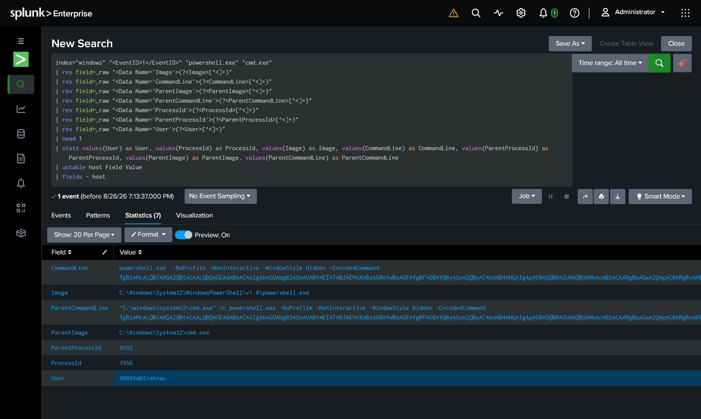

# Investigation 01 — Suspicious PowerShell Execution

**Date:** August 26, 2026
**Analyst:** Shravani Achal Hendre
**Environment:** Controlled Lab Simulation
**Status:** Completed

---

## 🔎 Investigation Overview

This investigation examined suspicious PowerShell execution observed on the Windows 11 endpoint `SHRAVANI`.

A PowerShell process was launched by `cmd.exe` with:

* Hidden window execution
* `-NoProfile`
* `-NonInteractive`
* An encoded PowerShell command

The activity was investigated using Sysmon process creation telemetry in Splunk.

---

## 🎯 Investigation Objective

The investigation aimed to determine:

* What process started PowerShell?
* What command was executed?
* Was the command obfuscated?
* What did the decoded command do?
* Was there additional suspicious activity?
* How should the activity be classified?

---

## 🖥️ Environment

| Component               | Details                    |
| ----------------------- | -------------------------- |
| Endpoint                | Windows 11                 |
| Hostname                | `SHRAVANI`                 |
| User                    | `SHRAVANI\shrav`           |
| Monitoring              | Sysmon                     |
| Log Collection          | Splunk Universal Forwarder |
| SIEM                    | Splunk Enterprise          |
| Investigation Interface | Splunk Web                 |

---

## 🔍 Initial Detection

The following SPL query was used to identify PowerShell process creation events involving `cmd.exe`:

```spl
index="windows" "<EventID>1</EventID>" "powershell.exe" "cmd.exe"
```

### Key Event

**Timestamp:**

```text
2026-08-26 08:20:48.653 AM
```

**Host:**

```text
SHRAVANI
```

**User:**

```text
SHRAVANI\shrav
```

**Process ID:**

```text
7956
```

**Image:**

```text
C:\Windows\System32\WindowsPowerShell\v1.0\powershell.exe
```

**Parent Process ID:**

```text
9252
```

---

## 🌳 Process Relationship

The process creation telemetry showed:

```text
cmd.exe
   │
   └── powershell.exe
```

The parent process was:

```text
C:\windows\system32\cmd.exe
```

The PowerShell process was launched with:

```text
-NoProfile
-NonInteractive
-WindowStyle Hidden
-EncodedCommand
```

---

## 🧾 Command-Line Analysis

### PowerShell Command

The command line contained an encoded PowerShell command:

```text
powershell.exe -NoProfile -NonInteractive -WindowStyle Hidden -EncodedCommand <Base64>
```

### Parent Command

```text
"C:\windows\system32\cmd.exe" /c powershell.exe -NoProfile -NonInteractive -WindowStyle Hidden -EncodedCommand <Base64>
```

The use of `-EncodedCommand` required decoding to determine the actual behavior.

---

## 🔓 Decoded Command

The decoded PowerShell command was:

```powershell
New-Item -Path "$env:PUBLIC\soclab_marker.txt" -ItemType File -Force
```

This creates the following file:

```text
C:\Users\Public\soclab_marker.txt
```

The command was intentionally generated as part of the controlled lab simulation.

---

## 🧠 MITRE ATT&CK Mapping

| Technique                       | ID        | Relevance                                  |
| ------------------------------- | --------- | ------------------------------------------ |
| PowerShell                      | T1059.001 | PowerShell was used to execute the command |
| Obfuscated Files or Information | T1027     | The PowerShell command was encoded         |

---

## 📸 Evidence

### 01 — Search Results


### 02 — Process Creation


### 03 — Command Line



---

## 🧩 Investigation Findings

The investigation established the following:

1. `cmd.exe` launched `powershell.exe`.
2. PowerShell was executed with a hidden window.
3. The command used Base64 encoding.
4. The encoded command was successfully decoded.
5. The decoded command created a harmless marker file.
6. The activity was generated intentionally in the lab.
7. No evidence from this investigation indicated unauthorized activity.

---

## 🚦 Final Classification

**Controlled Simulation**

The observed PowerShell execution contained behaviors commonly investigated in SOC environments, including encoded PowerShell and hidden execution.

However, in this controlled lab, the activity was intentionally generated for investigation practice.

---

## 📌 Investigation Outcome

**Escalation:** Not required for this controlled simulation.

The investigation demonstrated the use of:

* Sysmon process telemetry
* Splunk search
* Parent-child process analysis
* Command-line investigation
* PowerShell decoding
* MITRE ATT&CK mapping
* Security event classification

---

## ⚠️ Disclaimer

This investigation was performed in a controlled laboratory environment.

The activity was intentionally generated for cybersecurity monitoring and investigation practice.

No unauthorized systems were targeted.
