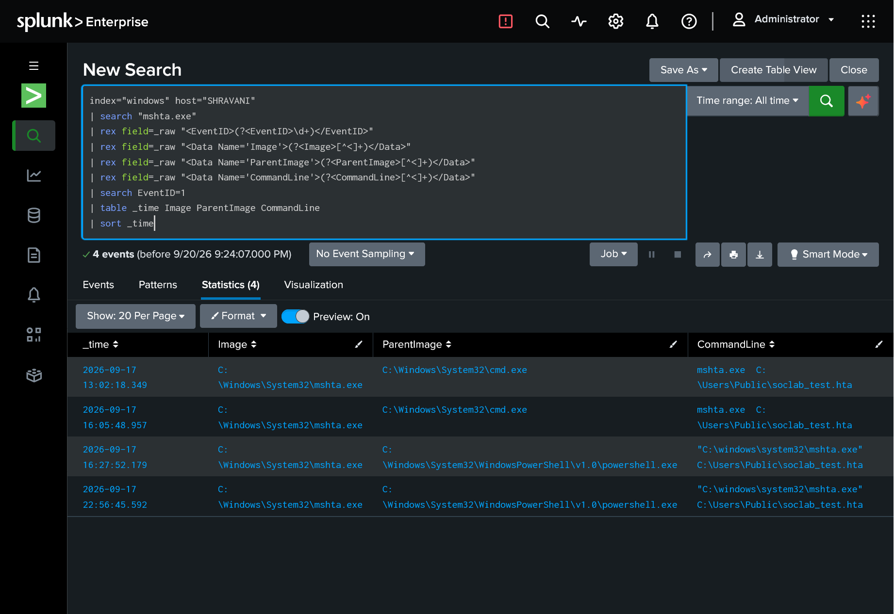
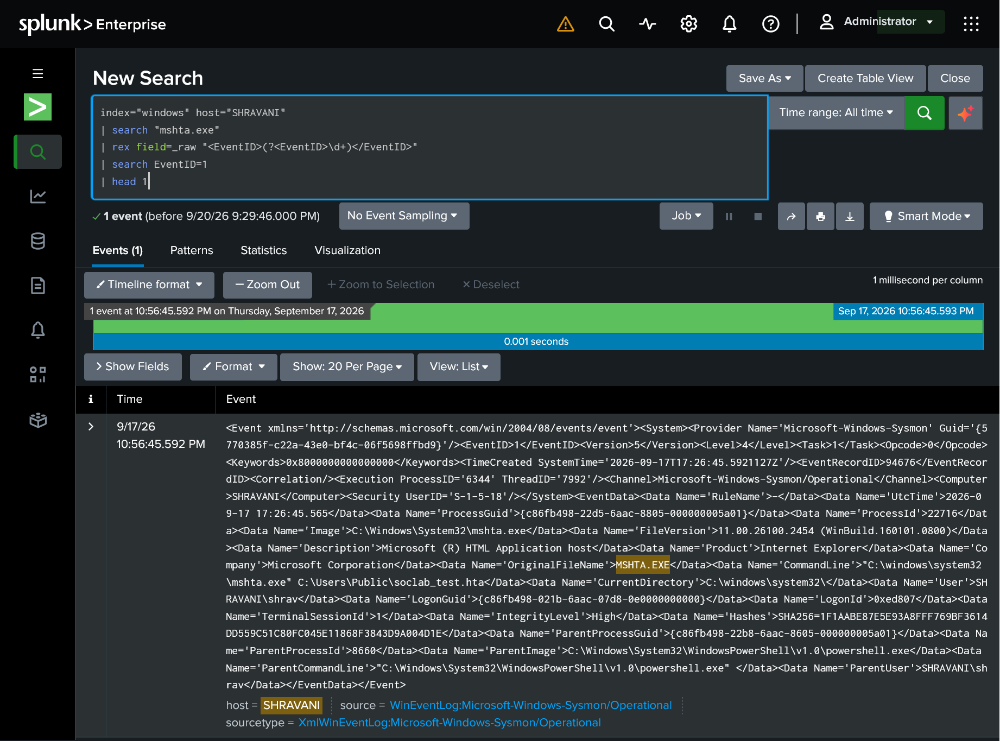
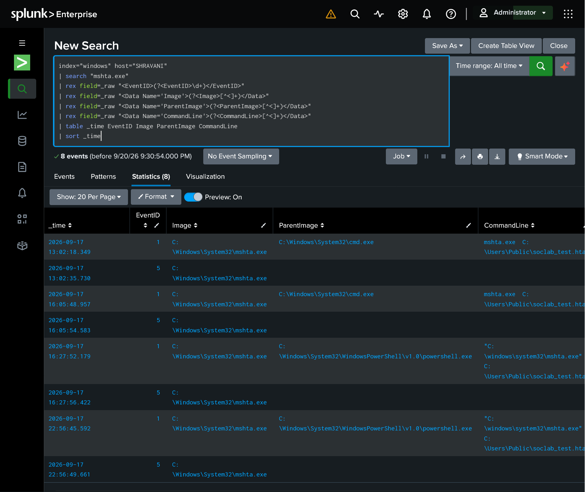
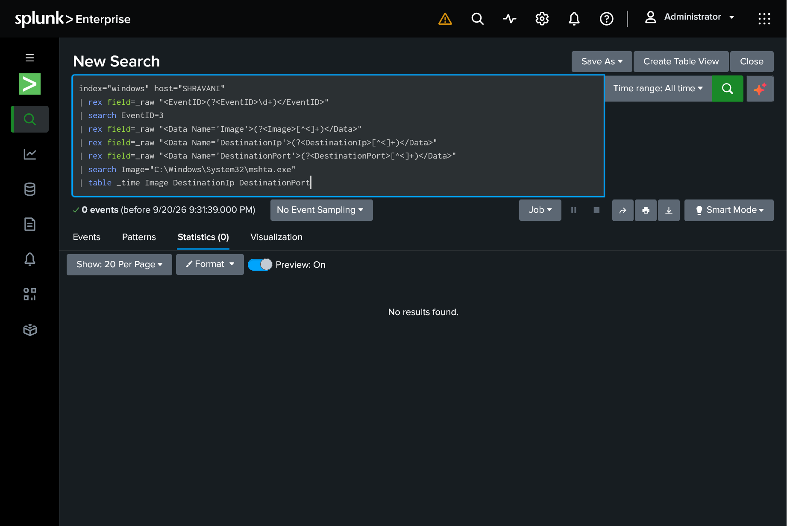
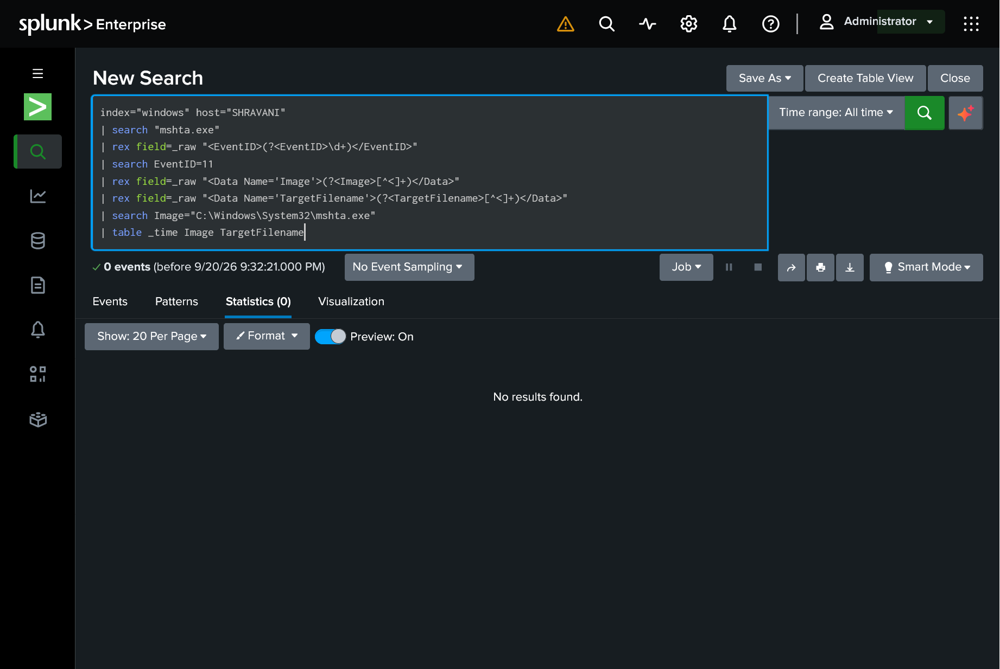
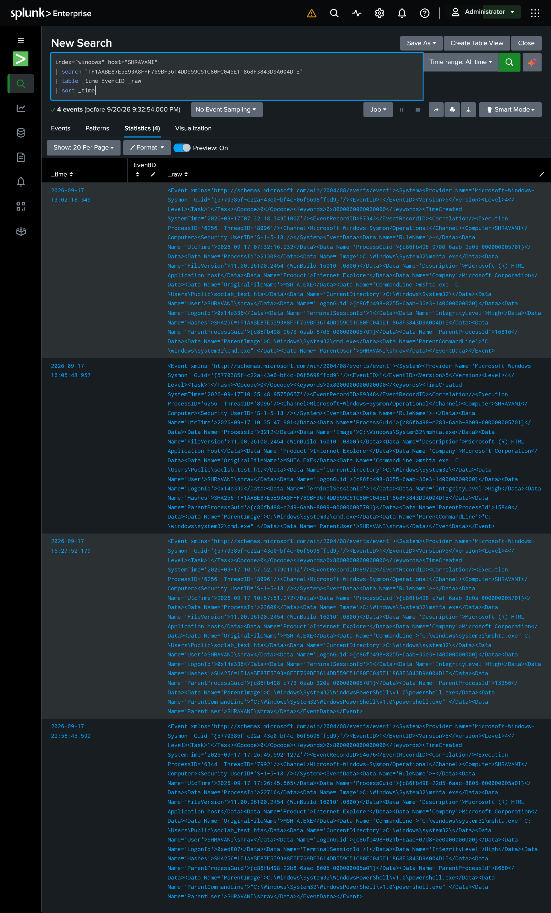

# Investigation 02 — Suspicious `mshta.exe` Execution

**Date:** September 17, 2026

**Analyst:** Shravani Achal Hendre

**Environment:** Controlled Lab Simulation

**Status:** Completed

---

## 🔎 Investigation Overview

This investigation examined the execution of `mshta.exe` on the Windows 11 endpoint `SHRAVANI`.

`mshta.exe` is a legitimate Windows utility that can execute HTML Applications (HTA files). Because the utility can also be abused by attackers, its execution was investigated as potentially suspicious activity.

A controlled benign HTA file was used for this lab test.

---

## 🎯 Investigation Objective

The investigation aimed to determine:

* How `mshta.exe` was executed
* Which process launched it
* What file was involved
* Whether network activity occurred
* Whether additional files were created
* Whether the observed hash appeared elsewhere
* Whether the activity required escalation

---

## 🖥️ Environment

| Component               | Details                    |
| ----------------------- | -------------------------- |
| Endpoint                | Windows 11                 |
| Hostname                | `SHRAVANI`                 |
| User                    | `SHRAVANI\shrav`           |
| Monitoring              | Sysmon                     |
| Log Collection          | Splunk Universal Forwarder |
| SIEM                    | Splunk Enterprise          |
| Investigation Interface | Splunk Web                 |

---

## 🧪 Controlled Test

A harmless HTA file was created for the investigation:

```text
C:\Users\Public\soclab_test.hta
```

The test was executed using:

```text
mshta.exe C:\Users\Public\soclab_test.hta
```

The HTA displayed a simple alert and then closed.

---

## 🔍 Initial Findings

A broad search identified **8 related Sysmon events**:

* 4 Process Creation events
* 4 Process Termination events

### Process Creation Timeline

| Timestamp               | Event      | Process     | Parent     |
| ----------------------- | ---------- | ----------- | ---------- |
| 2026-09-17 13:02:18.349 | Event ID 1 | `mshta.exe` | `cmd.exe`  |
| 2026-09-17 16:05:48.957 | Event ID 1 | `mshta.exe` | `cmd.exe`  |
| 2026-09-17 16:27:52.179 | Event ID 1 | `mshta.exe` | PowerShell |
| 2026-09-17 22:56:45.592 | Event ID 1 | `mshta.exe` | PowerShell |

Each process creation event was followed by a corresponding process termination event.

---

## 🌳 Process Relationships

The observed process relationships included:

```text
cmd.exe
   │
   └── mshta.exe
```

and:

```text
powershell.exe
   │
   └── mshta.exe
```

---

## 🧾 Raw Event Details

The Sysmon Event ID 1 telemetry showed:

**Image:**

```text
C:\Windows\System32\mshta.exe
```

**Description:**

```text
Microsoft (R) HTML Application host
```

**Company:**

```text
Microsoft Corporation
```

**Original File Name:**

```text
MSHTA.EXE
```

**User:**

```text
SHRAVANI\shrav
```

**Integrity Level:**

```text
High
```

**SHA256:**

```text
1F1AABE87E5E93A8FFF769BF3614DD559C51C80FC045E11868F3843D9A004D1E
```

---

## 🌐 Network Activity Check

A Sysmon Event ID 3 search was performed to check for network connections associated with the activity.

**Result:**

```text
0 events
```

No Sysmon Event ID 3 network connection associated with `mshta.exe` was observed in the available telemetry.

---

## 📄 File Creation Check

A Sysmon Event ID 11 search was performed to identify file creation attributed to `mshta.exe`.

**Result:**

```text
0 events
```

No Sysmon Event ID 11 file creation attributed to `mshta.exe` was observed in the available telemetry.

---

## 🔎 IOC Pivot — HTA File

The following file path was used as an IOC pivot:

```text
C:\Users\Public\soclab_test.hta
```

The pivot returned the same four process creation events associated with the controlled test.

No additional related activity was identified through this pivot.

---

## 🔐 IOC Pivot — SHA256

The observed `mshta.exe` SHA256 was also used as a pivot:

```text
1F1AABE87E5E93A8FFF769BF3614DD559C51C80FC045E11868F3843D9A004D1E
```

The hash pivot returned the same known events.

No additional activity was identified.

---

## 🧠 MITRE ATT&CK Mapping

| Technique             | ID        | Relevance                                   |
| --------------------- | --------- | ------------------------------------------- |
| Mshta                 | T1218.005 | `mshta.exe` was executed                    |
| PowerShell            | T1059.001 | PowerShell was observed as a parent process |
| Windows Command Shell | T1059.003 | `cmd.exe` was observed as a parent process  |

---

## 📸 Evidence

### 01 — Process Creation



### 02 — Raw Event



### 03 — Timeline



### 04 — Network Check



### 05 — File Creation Check



### 06 — Hash Pivot



---

## 🧩 Investigation Findings

The investigation established that:

1. `mshta.exe` was executed multiple times during the controlled test.
2. Both `cmd.exe` and PowerShell were observed as parent processes.
3. The executed binary was the legitimate Windows `mshta.exe` located in `System32`.
4. The HTA file was intentionally created for the lab.
5. No associated Sysmon Event ID 3 network connection was observed.
6. No associated Sysmon Event ID 11 file creation was observed.
7. The file-path pivot returned only the known test activity.
8. The SHA256 pivot returned only the known test activity.
9. No additional suspicious child-process activity originating from `mshta.exe` was observed in the available telemetry.

---

## 🚦 Final Classification

**Controlled / Benign Lab Activity**

The execution of `mshta.exe` was investigated because it is a Windows utility that can be relevant to suspicious activity.

In this investigation, the observed execution was part of an intentionally generated benign lab test.

---

## 📌 Escalation Decision

**No escalation required.**

Based on the available telemetry, there was no additional evidence indicating malicious activity.

---

## ⚠️ Disclaimer

This investigation was performed in a controlled laboratory environment using intentionally generated benign activity.

The commands, files, and executions were created for cybersecurity monitoring and investigation practice.

No unauthorized systems or real-world targets were involved.
