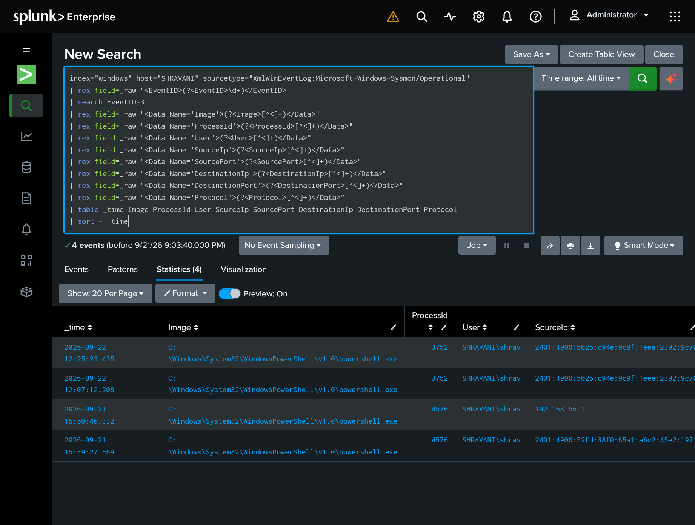
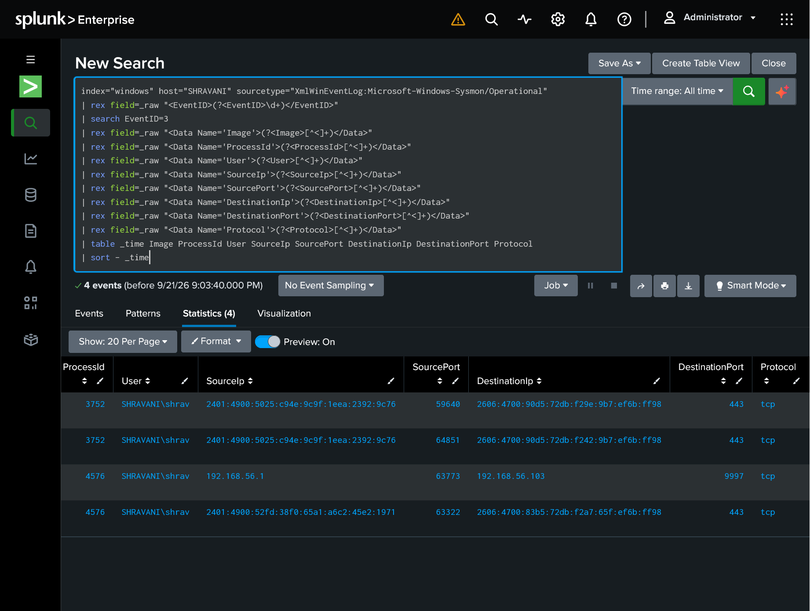
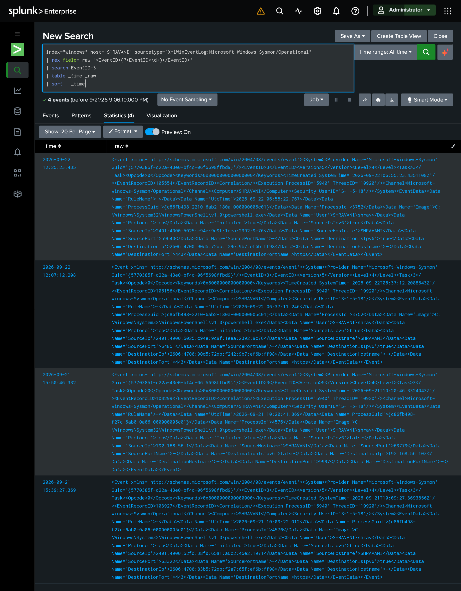
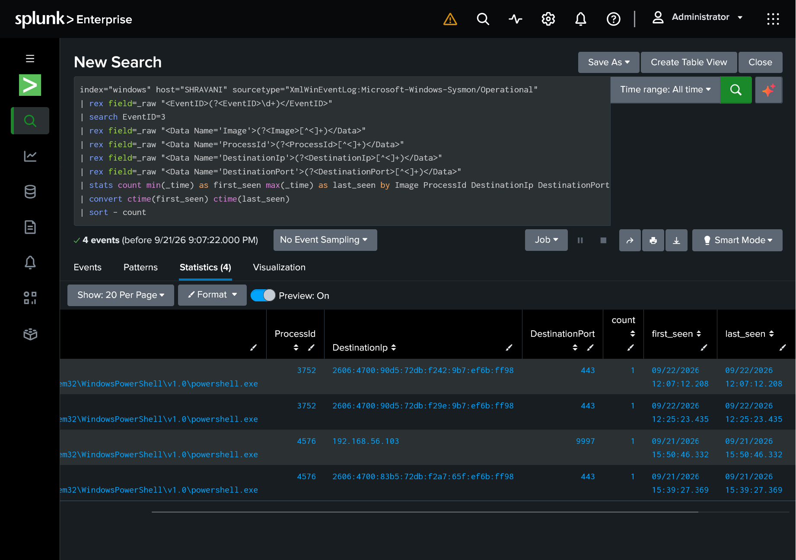
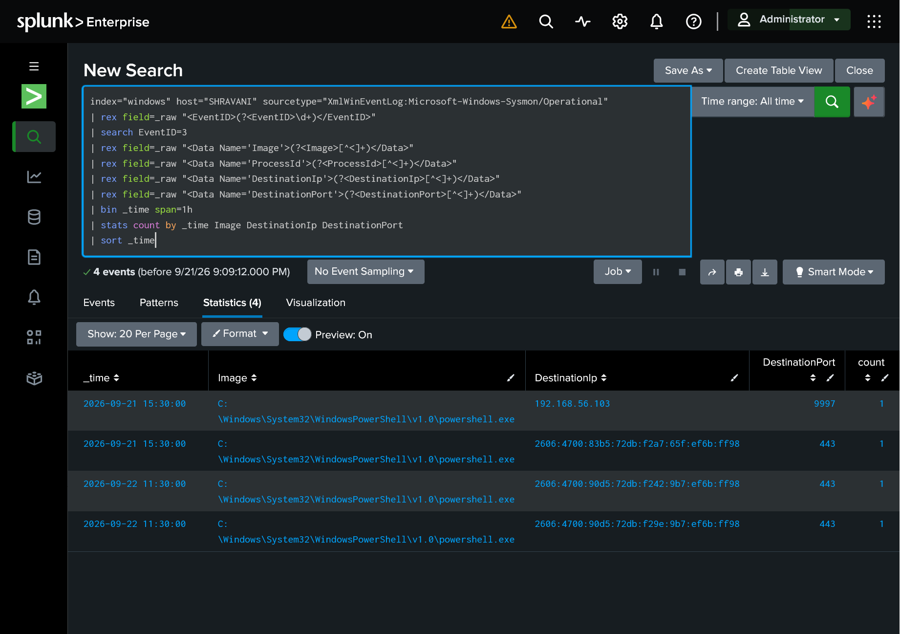
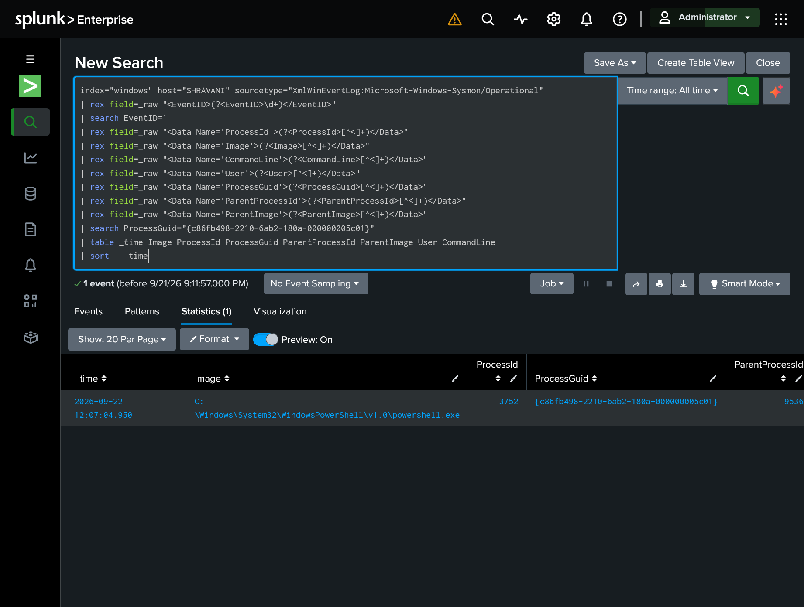
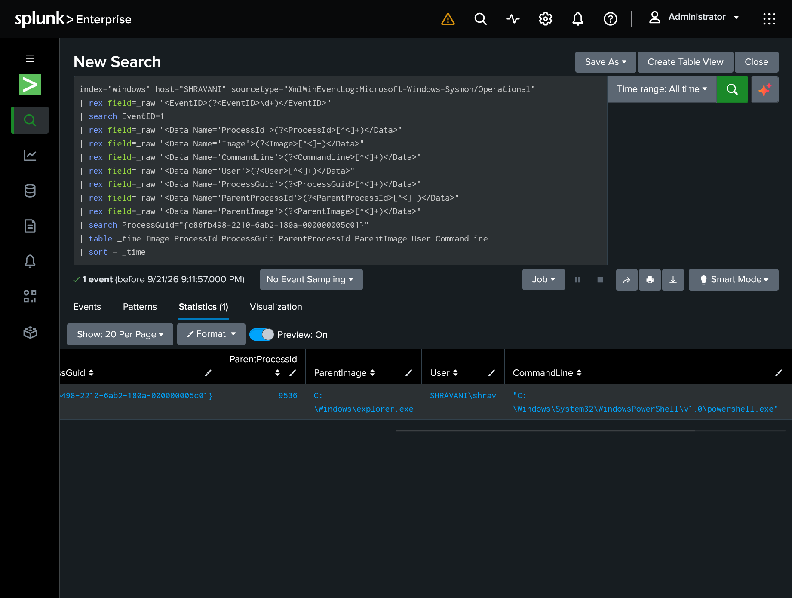
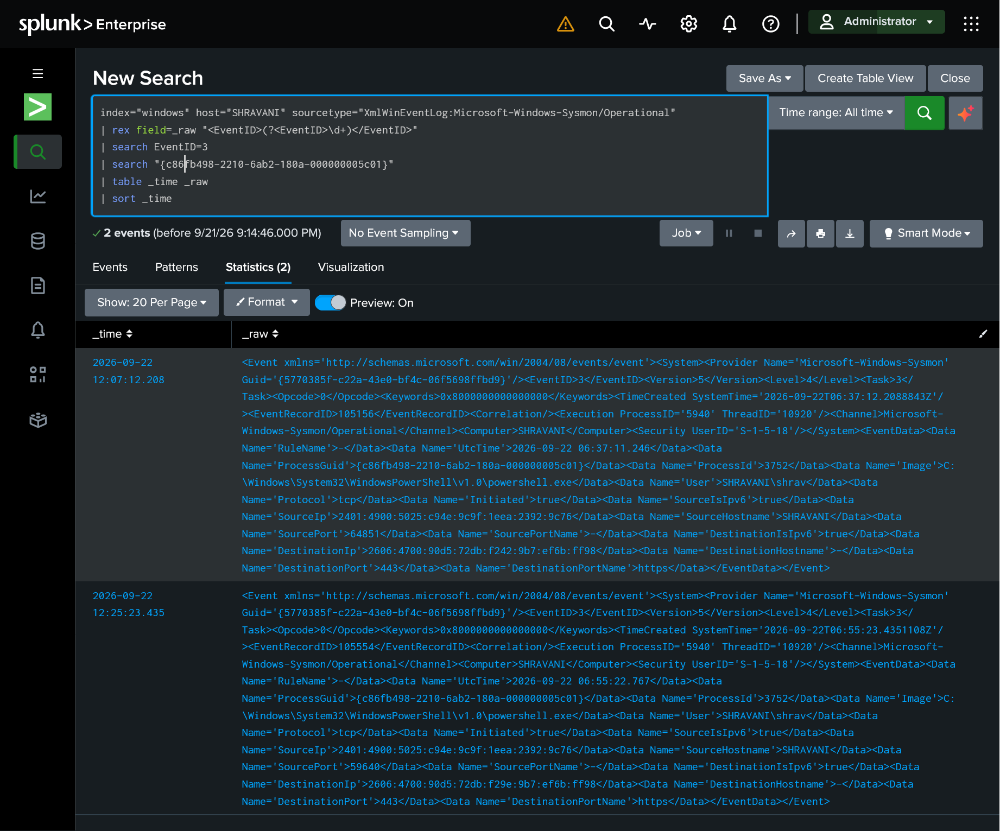
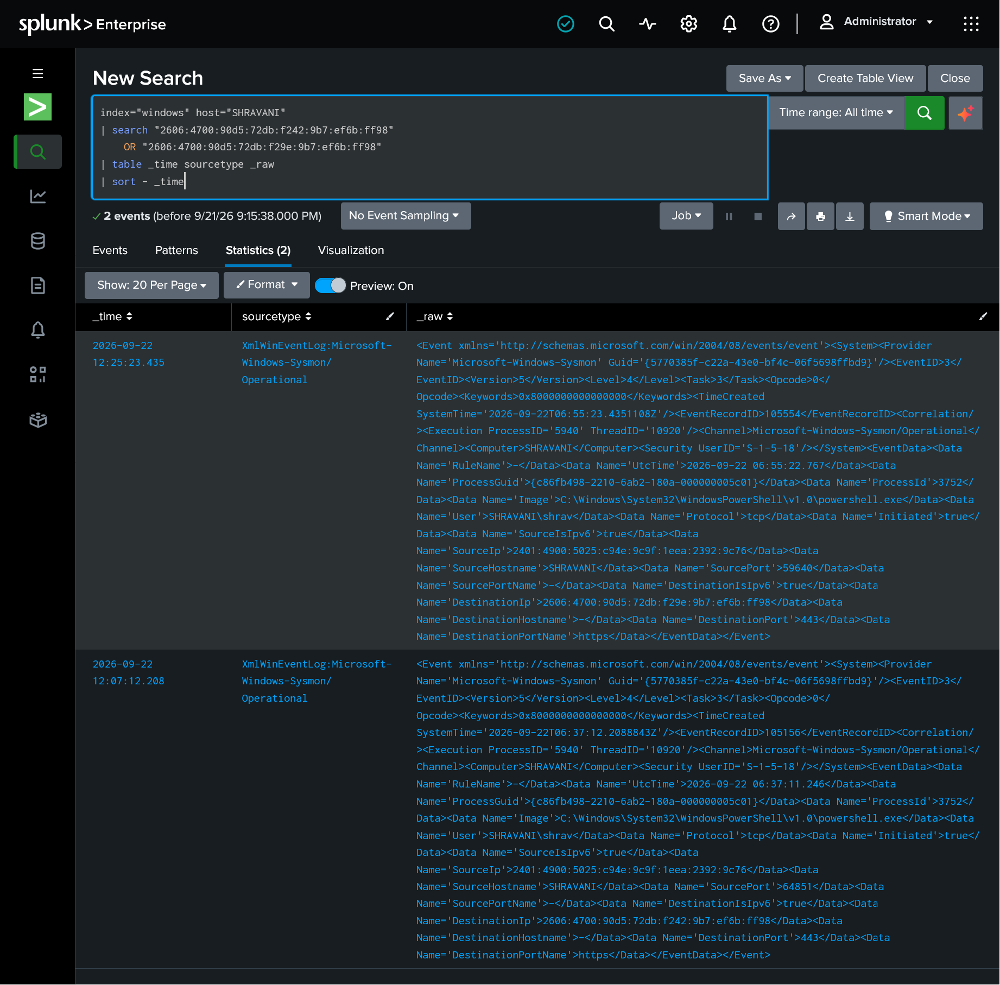
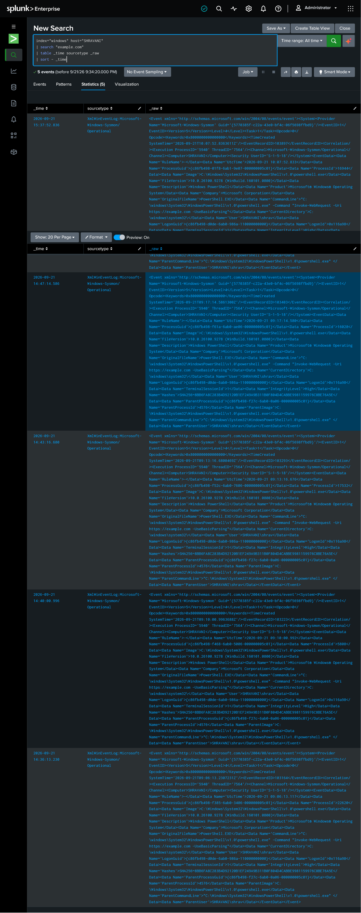

# Investigation 03 — Network Correlation & C2 Beacon Detection

**Project:** Multi-Stage SOC Investigation

**Investigation:** 03

**Date:** September 22, 2026

**Analyst:** Shravani Hendre

**Environment:** Controlled Lab Simulation

**Status:** Completed

---

## 1. Objective

The objective of this investigation was to determine whether a process on the Windows endpoint was making suspicious network connections that could indicate Command and Control (C2) activity.

The investigation focused on:

* Identifying network connections
* Identifying the process responsible for the connection
* Checking destination IP addresses and ports
* Looking for repeated connections or beaconing behavior
* Correlating network activity with process activity
* Performing IOC pivots
* Mapping relevant activity to MITRE ATT&CK
* Making a final classification and escalation decision

---

## 2. Lab Environment

### Windows Endpoint

* **Hostname:** `SHRAVANI`
* **OS:** Windows 11
* **Telemetry:** Sysmon
* **Forwarder:** Splunk Universal Forwarder

### Splunk Server

* **Hostname:** `SOC-Splunk`
* **OS:** Ubuntu Server
* **SIEM:** Splunk Enterprise

### Data Flow

```text
Windows 11
    │
    ▼
Sysmon
    │
    ▼
Splunk Universal Forwarder
    │
    ▼
Splunk Enterprise
    │
    ▼
Splunk Web
    │
    ▼
SOC Analyst
```

---

## 3. Investigation Workflow

```text
Network Connection
       ↓
Identify Process
       ↓
Check Destination
       ↓
Check Repeated Connections
       ↓
Correlate Process + Network Activity
       ↓
IOC Pivot
       ↓
MITRE ATT&CK Mapping
       ↓
Final Classification
```

---

# 4. Network Telemetry

Sysmon Event ID 3 was enabled for PowerShell network connections.

The investigation confirmed that Sysmon was successfully collecting network connection telemetry.

### Sysmon Event ID 3

**Event ID 3 = Network Connection**

It records information such as:

* Process
* Process ID
* Source IP
* Source port
* Destination IP
* Destination port
* Protocol
* User

---

## 5. Network Connection Evidence

The following SPL query was used to identify Sysmon Event ID 3 events:

```spl
index="windows" host="SHRAVANI" sourcetype="XmlWinEventLog:Microsoft-Windows-Sysmon/Operational"
| rex field=_raw "<EventID>(?<EventID>\d+)</EventID>"
| search EventID=3
| rex field=_raw "<Data Name='Image'>(?<Image>[^<]+)</Data>"
| rex field=_raw "<Data Name='ProcessId'>(?<ProcessId>[^<]+)</Data>"
| rex field=_raw "<Data Name='User'>(?<User>[^<]+)</Data>"
| rex field=_raw "<Data Name='SourceIp'>(?<SourceIp>[^<]+)</Data>"
| rex field=_raw "<Data Name='SourcePort'>(?<SourcePort>[^<]+)</Data>"
| rex field=_raw "<Data Name='DestinationIp'>(?<DestinationIp>[^<]+)</Data>"
| rex field=_raw "<Data Name='DestinationPort'>(?<DestinationPort>[^<]+)</Data>"
| rex field=_raw "<Data Name='Protocol'>(?<Protocol>[^<]+)</Data>"
| table _time Image ProcessId User SourceIp SourcePort DestinationIp DestinationPort Protocol
| sort - _time
```

### Results

Four network connection events were observed in the available telemetry:

| Time                | Process    |  PID | Destination                              | Port | Protocol |
| ------------------- | ---------- | ---: | ---------------------------------------- | ---: | -------- |
| 2026-09-22 12:25:23 | PowerShell | 3752 | `2606:4700:90d5:72db:f29e:9b7:ef6b:ff98` |  443 | TCP      |
| 2026-09-22 12:07:12 | PowerShell | 3752 | `2606:4700:90d5:72db:f242:9b7:ef6b:ff98` |  443 | TCP      |
| 2026-09-21 15:50:46 | PowerShell | 4576 | `192.168.56.103`                         | 9997 | TCP      |
| 2026-09-21 15:39:27 | PowerShell | 4576 | `2606:4700:83b5:72db:f2a7:65f:ef6b:ff98` |  443 | TCP      |

All observed connections were associated with the user:

`SHRAVANI\shrav`

---

## 6. Destination Analysis

### External HTTPS Connections

The PowerShell process with PID `3752` made two observed HTTPS connections:

**Connection 1**

```text
PowerShell PID 3752
        ↓
2606:4700:90d5:72db:f242:9b7:ef6b:ff98
        ↓
TCP/443
```

**Connection 2**

```text
PowerShell PID 3752
        ↓
2606:4700:90d5:72db:f29e:9b7:ef6b:ff98
        ↓
TCP/443
```

The two connections occurred approximately **18 minutes apart** and used different destination IP addresses.

Port `443` represents HTTPS traffic, but the use of HTTPS alone does not establish malicious or C2 activity.

---

### Internal Splunk Connection

The following connection was also observed:

```text
PowerShell PID 4576
        ↓
192.168.56.103:9997
```

Port `9997` is the Splunk receiving port used by the lab environment.

This connection was therefore considered expected lab infrastructure traffic.

---

# 7. Beaconing / Repeated Connection Analysis

To check for repeated connections, the following SPL query was used:

```spl
index="windows" host="SHRAVANI" sourcetype="XmlWinEventLog:Microsoft-Windows-Sysmon/Operational"
| rex field=_raw "<EventID>(?<EventID>\d+)</EventID>"
| search EventID=3
| rex field=_raw "<Data Name='Image'>(?<Image>[^<]+)</Data>"
| rex field=_raw "<Data Name='ProcessId'>(?<ProcessId>[^<]+)</Data>"
| rex field=_raw "<Data Name='DestinationIp'>(?<DestinationIp>[^<]+)</Data>"
| rex field=_raw "<Data Name='DestinationPort'>(?<DestinationPort>[^<]+)</Data>"
| stats count min(_time) as first_seen max(_time) as last_seen by Image ProcessId DestinationIp DestinationPort
| convert ctime(first_seen) ctime(last_seen)
| sort - count
```

### Result

Each exact:

```text
Process + Destination IP + Destination Port
```

combination appeared only once.

Therefore:

* No repeated connection to the same destination was observed.
* No clear regular beaconing pattern was identified.
* `first_seen` and `last_seen` were the same for each observed combination.

---

## 8. Time-Based Beaconing Check

A time-bucketed analysis was also performed:

```spl
index="windows" host="SHRAVANI" sourcetype="XmlWinEventLog:Microsoft-Windows-Sysmon/Operational"
| rex field=_raw "<EventID>(?<EventID>\d+)</EventID>"
| search EventID=3
| rex field=_raw "<Data Name='Image'>(?<Image>[^<]+)</Data>"
| rex field=_raw "<Data Name='ProcessId'>(?<ProcessId>[^<]+)</Data>"
| rex field=_raw "<Data Name='DestinationIp'>(?<DestinationIp>[^<]+)</Data>"
| rex field=_raw "<Data Name='DestinationPort'>(?<DestinationPort>[^<]+)</Data>"
| bin _time span=1h
| stats count by _time Image DestinationIp DestinationPort
| sort _time
```

### Result

The observed connections appeared as individual events rather than a regular repeated pattern.

No clear periodic beaconing behavior was identified in the available telemetry.

---

# 9. Process Correlation

The next step was to identify the exact PowerShell process responsible for the network activity.

The process creation event for PID `3752` showed:

```text
Time: 2026-09-22 12:07:04.950
Image: C:\Windows\System32\WindowsPowerShell\v1.0\powershell.exe
Process ID: 3752
User: SHRAVANI\shrav
```

The process had the following Process GUID:

```text
{c86fb498-2210-6ab2-180a-000000005c01}
```

The parent process was:

```text
explorer.exe
```

A `conhost.exe` process was also spawned by this PowerShell process.

---

## 10. Process GUID Correlation

Because Windows process IDs can be reused, the **Process GUID** was used for more reliable correlation.

The exact Process GUID was searched across process creation events.

The results confirmed:

```text
explorer.exe
     ↓
PowerShell PID 3752
     ↓
conhost.exe
```

The same Process GUID was then searched in Sysmon Event ID 3.

### Result

The exact PowerShell process was associated with two observed network connections:

```text
12:07:12
PowerShell PID 3752
        ↓
2606:4700:90d5:72db:f242:9b7:ef6b:ff98:443
```

and

```text
12:25:23
PowerShell PID 3752
        ↓
2606:4700:90d5:72db:f29e:9b7:ef6b:ff98:443
```

This confirmed that the same PowerShell process generated both observed network events.

---

# 11. IOC Pivot

An IOC pivot was performed using the two external destination IP addresses.

### IOC 1

```text
2606:4700:90d5:72db:f242:9b7:ef6b:ff98
```

### IOC 2

```text
2606:4700:90d5:72db:f29e:9b7:ef6b:ff98
```

The IP addresses were searched across the Windows index.

### Result

Only the corresponding Sysmon network events were returned.

No additional telemetry containing these exact IP addresses was identified.

---

## 12. Controlled Test Correlation

Previous controlled network testing involving `example.com` was also reviewed.

Searching for `example.com` returned PowerShell commands using:

```text
Invoke-WebRequest -Uri https://example.com -UseBasicParsing
```

However, these events were associated with different process IDs and occurred on September 21.

Therefore, the September 22 network events were **not directly attributed to those earlier commands**.

A search for the exact text:

```text
Test-NetConnection
```

in Sysmon Process Creation events returned no results.

This means the exact command responsible for the September 22 connections was not captured in the available Event ID 1 command-line telemetry.

---

# 13. MITRE ATT&CK Mapping

### T1059.001 — PowerShell

**Observed behavior:**

`powershell.exe` was the process responsible for the observed network connections.

PowerShell is therefore relevant to the investigation and was mapped to:

**T1059.001 — PowerShell**

### Command and Control

C2 activity was investigated, but the available evidence did **not** establish confirmed Command and Control communication.

The observed HTTPS connections alone were insufficient to classify them as C2.

No confirmed C2 technique was therefore assigned.

---

# 14. Findings

### Finding 1 — PowerShell Network Activity

A PowerShell process with PID `3752` generated two observed external HTTPS network connections.

### Finding 2 — No Clear Beaconing

The connections were to different destination IP addresses and did not show a regular repeated pattern in the available telemetry.

### Finding 3 — IOC Pivot

Searching the observed destination IP addresses did not identify additional activity.

### Finding 4 — Expected Lab Traffic

A connection to:

```text
192.168.56.103:9997
```

was identified as expected Splunk lab traffic.

### Finding 5 — C2 Not Confirmed

The investigation did not provide sufficient evidence to confirm Command and Control activity.

---

# 15. Final Classification

**Classification:** Controlled / Benign Lab Activity

**Escalation:** No escalation required.

### Reason

The observed network activity occurred during controlled laboratory testing.

Although PowerShell made external HTTPS connections, the available telemetry did not show:

* Regular beaconing
* Repeated connections to the same destination
* Additional IOC activity
* Confirmed malicious payload execution
* Confirmed C2 communication

Therefore, the available evidence does not support classifying the activity as confirmed C2.

---

# 16. Investigation Limitations

The following limitations were identified:

* The exact command line responsible for the September 22 network connections was not captured in the available Event ID 1 telemetry.
* Only the network activity visible in the collected Sysmon telemetry was analyzed.
* The investigation did not independently determine ownership or reputation of the observed external IPv6 addresses.
* Absence of observed C2 behavior does not prove that C2 is impossible; it only means that no confirmed C2 behavior was identified in the available telemetry.

---

# 17. Evidence Screenshots

The investigation evidence is stored in the `screenshots` directory.

Recommended screenshot order:

### 01 — Network Connection Events

Shows the Sysmon Event ID 3 network connection results.




### 02 — Raw Network Event

Shows the raw Sysmon Event ID 3 data including process, source, destination and port information.



### 03 — Beaconing Analysis

Shows the repeated-connection aggregation results.



### 04 — Time-Based Analysis

Shows the time-bucketed network activity.



### 05 — Process Correlation

Shows the PowerShell process creation event and Process GUID.




### 06 — Process GUID Network Correlation

Shows the Event ID 3 events associated with the exact PowerShell Process GUID.



### 07 — IOC Pivot

Shows the search for the observed destination IP addresses.



### 08 — Controlled Test Correlation

Shows the `example.com` / controlled PowerShell activity reviewed during correlation.



---

# 18. Conclusion

This investigation examined network activity from the Windows endpoint and correlated the activity with the responsible PowerShell process.

Two external HTTPS connections were identified from the same PowerShell process. Further analysis did not reveal a regular beaconing pattern or additional activity associated with the observed destination IP addresses.

The investigation therefore did not establish confirmed C2 communication.

The activity was classified as:

**Controlled / Benign Lab Activity**

and no escalation was required.

---

## Analyst

**Shravani Hendre**

B.Tech Information Technology

Multi-Stage SOC Investigation Project

> **Disclaimer:** This investigation was performed in a controlled laboratory environment for educational and cybersecurity research purposes.
